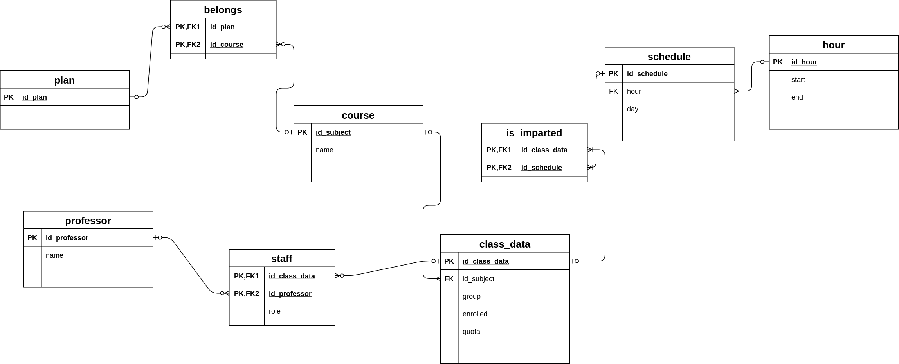

# Fciencias Data

This program collects data from the schedules from the [Faculty of Science website](www.fciencias.unam.mx/docencia/horarios/) and saves them into a SQLITE database. The data obtained follows this Relational Diagram, which can be used for make queries to the database generated:




Each request to get the data is made with a delay of **10 seconds**, with the purpose of not to overload the server.

## How to run?

**NOTE:** Before running the program, check the `requeriments.txt` file.

To use the program, run this:

```bash
python -m ciencias-scraper [SEMESTER]
```

The `[SEMESTER]` argument, which is optional, is a number of 5 digits, such as "20201" or "20211".

The result after run the program is a file called `fciencias.db` in the root directory. This can be used with SQLITE3:

```
sqlite3 fciencias.db
```

